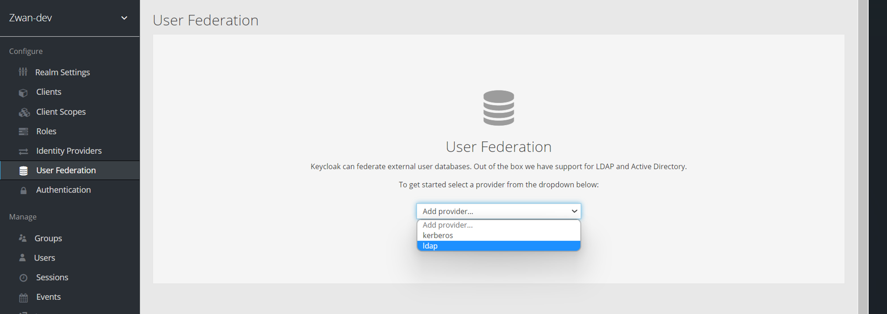

# Configuring the Users Storage Provider

\*\*Adding new User Federation

\*Login to the Admin Login of master Realm Console and select realm in left dropdown

\*Select the User Federation under Configure section

\*Select ldap from the Add director dropdown in right section

\*\*Provide the following data in the settings page:

- Enabled should be on
- Provide Console display name and Priority
- Import users should be on
- Editmode should be writable
- Sync Registrations should be on
- Select Vendor as Active Directory
- Username LDAP attribute and RDN LDAP attribute will be provided as sAMAccountName
- Provide UUID LDAP attribute as objectGUID
- Provide User Object classes with all possible container classes of users we have in AD (eg: user)

- Provide Connection URL ldap://AD_IP:port (eg: ldap://10.200.42.0:389)
- Provide Users DN with full DN of LDAP tree with all ou and DN tree (eg: dc=amzvdi,dc=local)
- Bind Type should be simple
- Enable StartTLS can be on/off. Select off for initial config
- Bind DN should be provided with DN of our LDAP Admin account (eg: cn=Administrator,cn=Users,dc=amzvdi,dc=local )
- Bind Credential should be provided with password to access LDAP Server(eg: **\*\*\***)
- Custom User LDAP filter should be (&(objectCategory=Person)(sAMAccountName=\*))
- Search Scope should be provided with Subtree
- Validate Password Policy and Trust Email can be left as it is
- User Truststore SPI can be selected with Only for ldaps

- Remaining settings can be left as default one
- Click Save to save the settings configured

- Now Click on Synchronize all users to update all ldap users to be updated in DB
  

# Login ldap user in director.

- Login in director (eg: https://10.11.111.31:443/zwan-tenant/), Credentials: superadmin@domain.com ~ password
- In left menu select Users
- In right side grid all users(Local user and ldap users) will be displayed.

- Go to edit user icon and assign roles, In Advanved tab select Edge Contorllers and click Update button.

- Once udpated successfully, then login with udpated user in director.
