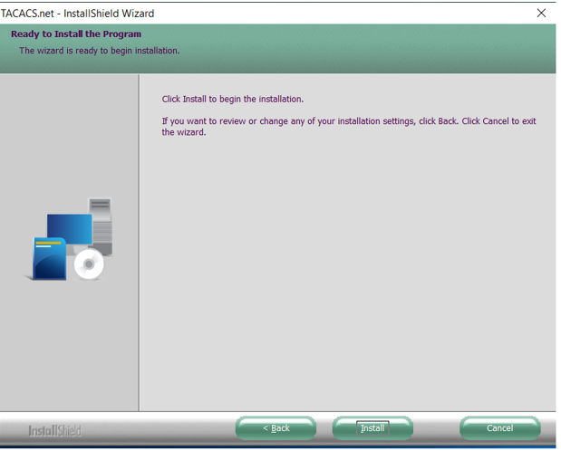

# Install TACACS

## Pre-requisites

### Supported Operating Systems

```
Windows Vista/Windows 7 or later
Windows Server 2008 or later
Windows 2008 Server DC or later
```

### Installation Requirements

```
1 GHz CPU
256 MB RAM
500 MB HDD free
```

## Installing Tacacs

Download the tacacs binary from  https://tacacs.net/download/

Run the installation wizard as administrator privilege.


Follow the instructions and proceed installation with wizard.





Make sure tacacd.net service is running after installation


### Configuration of the TACACS server  

To configure TACACS server three different .xml files that have to be modified under "C:\ProgramData\TACACS.net\config" path.  

```
- authentication.xml 
- clients.xml 
- tacplus.xml  
```

### Authentication file Changes

First, modify the authentication.xml. By default, user details will be commented.


Uncomment the users and modify the user credentials based on the need and save it.


### Client xml Changes

Modify the client IP address as tacacs server IP address and secret key.


### Tacplus file Changes

Modify the local IP as tacacs installed server IP and save it.

Restart TACACS service.


You can verify syntax errors by using tacverify in start menu.


### TacTest

Open command prompt from start menu.

tactest –s server ip  -k mykey -u myuser -p mypassword 

Output should be success


### References

https://secureservercdn.net/198.71.233.235/23a.303.myftpupload.com/wp-content/uploads/2022/03/TACACS.net_config_220318.pdf?time=1663313533

https://www.moxa.com/en/support/product-support/product-faq/how-to-configure-authentication-services-using-tacacs-server-for-windows-pcs-on-nport-6000-series
