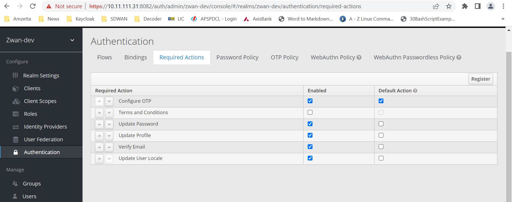
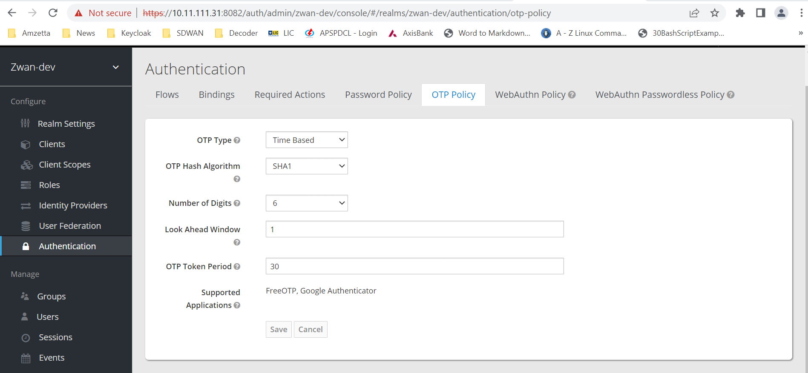
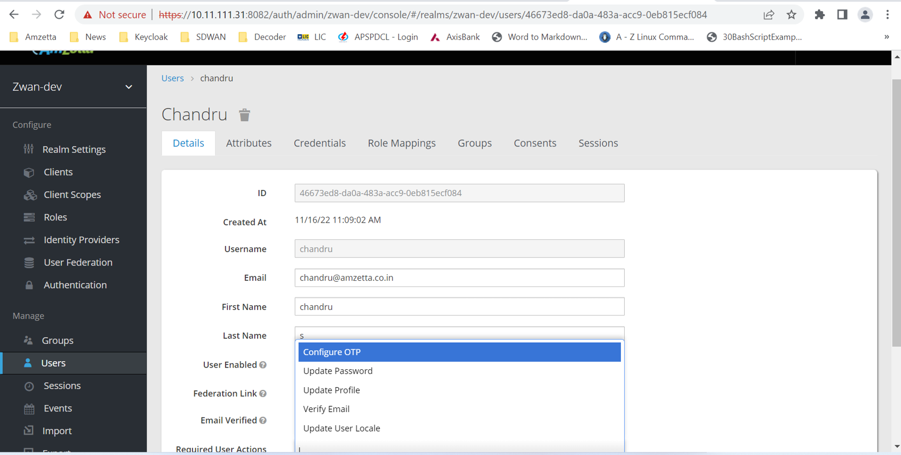
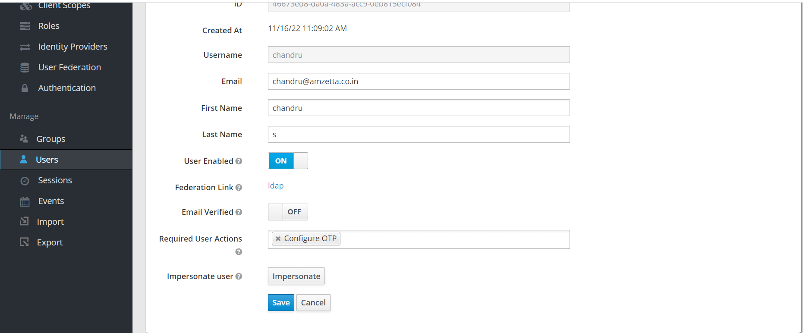
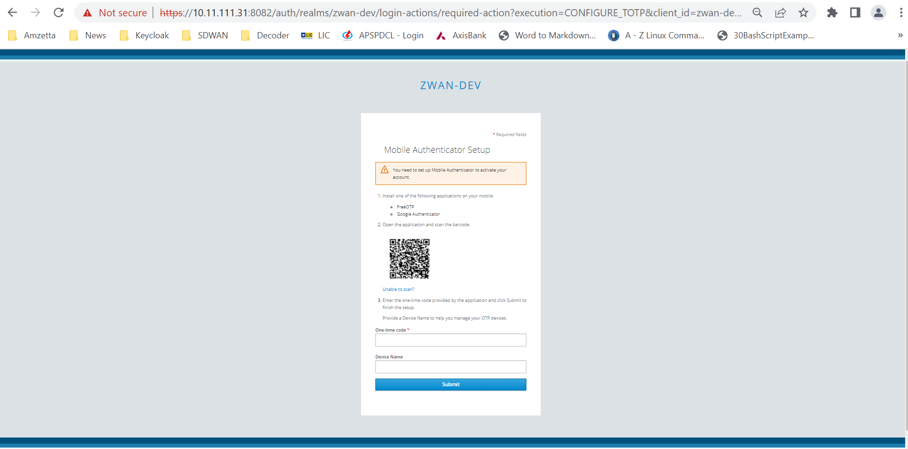
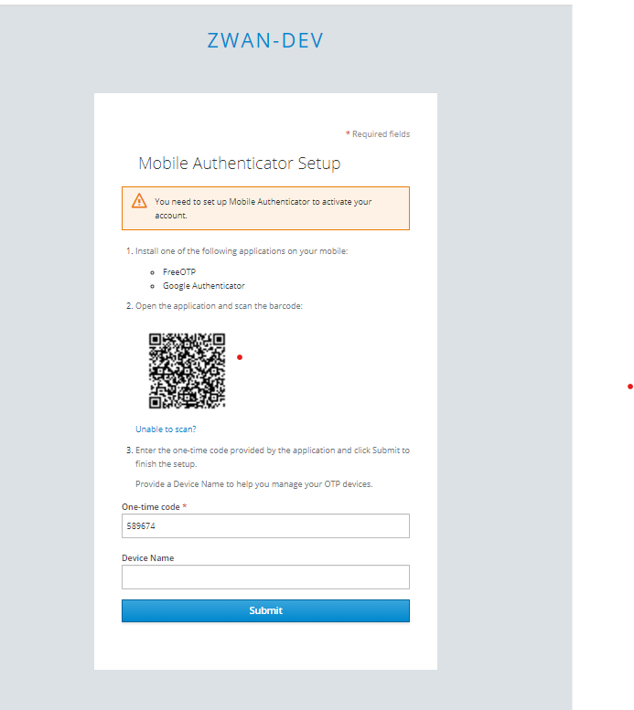

# 2FA configuration guide

\*\* Configure Multi factor authentication

- Login in zID with tenant specific, Goto "Authentication" menu[<tenant-name> -> configure -> Authentication], In authentication menu right side click on "Required Actions" tab.

- In configure OTP action enable the default action check box.
- In "OTP Policy" tab, Select OTP Type as "Time Based" and don't change remaining settings and click save button.

- Goto "Users" menu [<tenant-name> -> Manage -> Users] and click on Add user Or Edit button, It will show the user setting details.

- In "Details" tab Required User Actions label select the Configure OTP option if it is not enabled and save it.

\*\* Test multi factor authentication

- Goto director login.
- Login with the user credentials.
- It will ask for the OTP and it shows QR Code.

- User has to install "Google Authenticator" App and scan the QR code displayed in web page.
- In the app it will show the OTP, user has to enter that OTP in the web page.

- Click Submit button.
