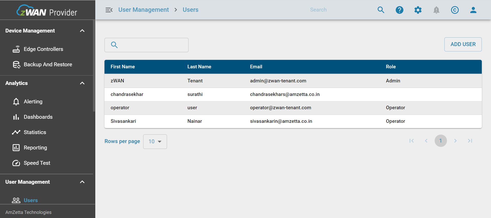
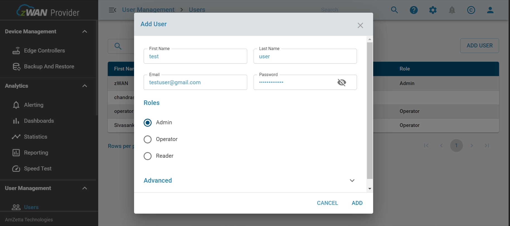
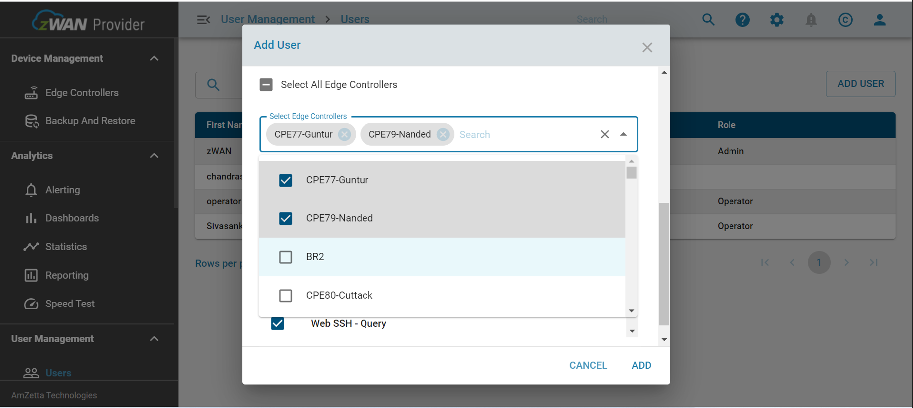
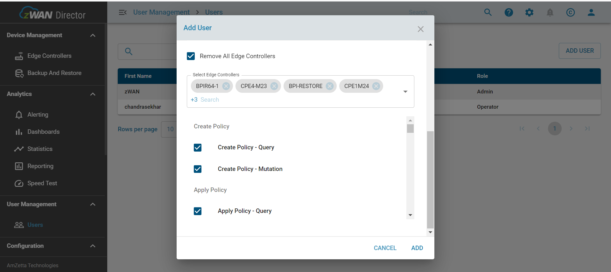
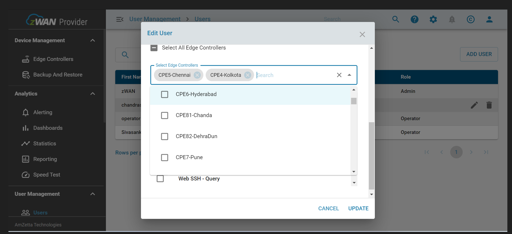
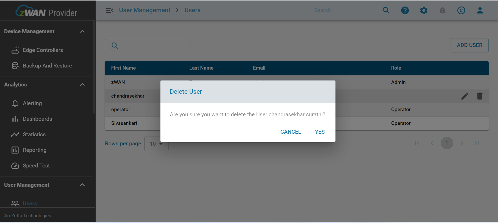

# Login with superadmin in director.

- Login in director (eg: https://10.11.111.31:443/zwan-tenant/), Credentials: superadmin@domain.com ~ password
- In left menu select Users
- In right side grid all users will be displayed.

# Add User

- Click "ADD USER" button and director user details, assign role and Edge controller's as shown in below.
  

- Assign Edge controller's to user.
  

- Assign Resources to user.
   

- Click "ADD" button.

# Edit User

- Click on "Edit" icon and change the user details, role and Edge controller[Assign Or Unassign] and hit "UPDATE" button.
  

# Delete user

- Click on "DELETE" icon to delete the user.
  
