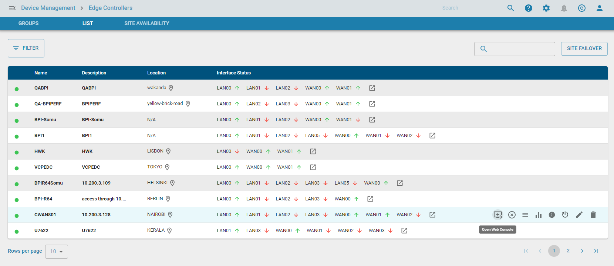
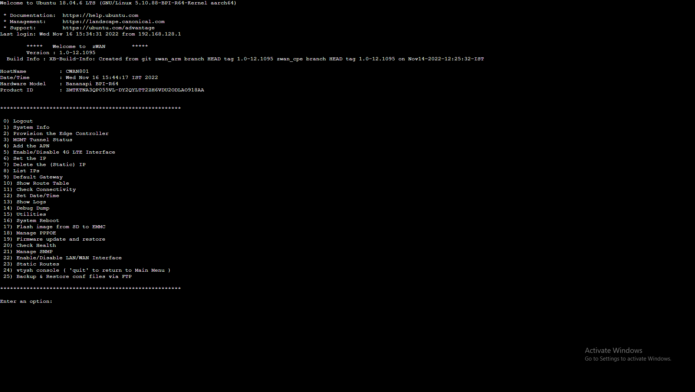

**Overview**

This feature allow the user to connect to your edge controller's console through browser.

**Functionality**

Following are the current functionalities available with the Web ssh

        1. Access the edge controller's console.

**Use cases**

List page:

1. Select the web console icon in the edge controller's list page.
   

2. The director will open web console session for edge controller in a new page.
   
